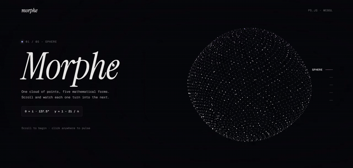

# Morphe

One cloud of 2,400 points, five mathematical forms. As you scroll, each form turns into the next one.

Built with plain HTML, CSS and JavaScript, and [p5.js](https://p5js.org) in WebGL mode. No build step, no framework.



[Watch the full video with color](video/demo.mp4)

## Features

- **Scroll-driven 3D**: the scroll position picks the current form and blends it into the next one.
- **Five parametric forms**: sphere, torus knot, wave, galaxy and bloom, each with its own palette.
- **Living shapes**: every form moves over time (breathing, drifting, orbiting).
- **Interaction**: the scene follows the mouse, and a click sends a pulse through the cloud.
- **Responsive**: on small screens the form sits above the text.
- **Accessible**: real HTML content, keyboard-friendly navigation, and support for `prefers-reduced-motion`.

## The forms

| Form   | Idea                                                         | Formula                               |
| ------ | ------------------------------------------------------------ | ------------------------------------- |
| Sphere | Points placed with the golden angle (Fibonacci sphere)       | `θ = i · 137.5°`, `y = 1 − 2i / n`    |
| Knot   | A (2, 3) torus knot with points flowing along it             | `r = 2 + cos 3φ`                      |
| Wave   | A grid lifted by crossing sine waves and a ripple            | `y = sin(3x + t) · cos(3z + t)`       |
| Galaxy | Three spiral arms, with faster inner orbits                  | `θ = 2πk / 3 + 3.4r + t / (0.35 + r)` |
| Bloom  | A sphere whose radius follows the angles                     | `r = 0.8 + 0.22 · sin 4θ · sin 3φ`    |

## Getting started

The project uses ES modules, so it has to be served over HTTP. Opening `index.html` directly from the file system will not work.

```bash
git clone https://github.com/<your-username>/morphe.git
cd morphe
```

Then start any static server from the project folder:

```bash
npx serve .
# or
python -m http.server 8000
```

and open the URL it prints (for example `http://localhost:8000`).

In VS Code, the **Live Server** extension works too: right-click `index.html`, then **Open with Live Server**.

## Project structure

```
morphe/
├── index.html      Page content and sections
├── css/
│   └── style.css   Layout, typography and responsive rules
├── js/
│   ├── main.js     Entry point: shared state, pointer events, p5 instance
│   ├── scene.js    The p5 sketch: morphing, camera and rendering
│   ├── shapes.js   The five forms and the point seeds
│   └── scroll.js   Scroll progress, section navigation and reveal
├── video/
│   ├── demo.gif    Short preview (README)
│   └── demo.mp4    Full demo recording
└── favicon.svg
```

## How it works

1. **Seeds.** Each of the 2,400 points gets a fixed seed: its index plus a few random numbers from a seeded generator, so the cloud looks the same on every load.
2. **Forms.** A form is a function `(seed, time, out) => void` that writes a position inside a unit sphere. Forms are evaluated every frame, which is why they can move.
3. **Scroll.** `scroll.js` turns the scroll position into a float: `0` on the first section, `1` on the second, `1.5` halfway between the second and the third.
4. **Morphing.** `scene.js` reads that value, evaluates the current and the next form for every point, and blends them with a smoothstep. The form holds still while its section is in view and changes between sections.
5. **Rendering.** Points are drawn as WebGL points with additive blending, grouped in batches that share a color and a size to keep draw calls low.

## Adding a form

1. Write a function in `js/shapes.js` that sets `out[0]`, `out[1]` and `out[2]` from a seed and a time:

   ```js
   function ring(s, t, out) {
     const angle = s.u * Math.PI * 2 + t * 0.2;
     out[0] = Math.cos(angle);
     out[1] = (s.a - 0.5) * 0.1;
     out[2] = Math.sin(angle);
   }
   ```

2. Add it to the `shapes` list, with a camera tilt and two colors:

   ```js
   { id: 'ring', tilt: -0.5, colors: ['#ffffff', '#8aa4ff'], position: ring },
   ```

3. Add a matching `<section data-section>` in `index.html` and a link in the section rail.

Sections and forms are matched by order.

## Browser support

Any recent browser with WebGL: Chrome, Edge, Firefox and Safari, on desktop and mobile.

## Credits

- [p5.js](https://p5js.org) for the rendering
- [Instrument Serif](https://fonts.google.com/specimen/Instrument+Serif) and [Geist Mono](https://fonts.google.com/specimen/Geist+Mono) from Google Fonts

## License

[MIT](LICENSE) © 2026 Kone Issa
